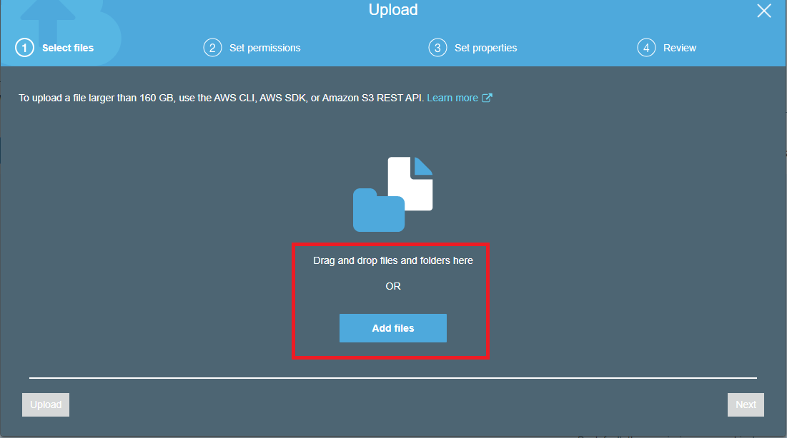

## <ins>Simple Storage Service _(S3)_:</ins>

- It's basically a storage engine.
- It uses a concept of _**bucket**_ which is similar to _folders_. It is posiible to create a bucket within a bucket and so on.
- While creating a parent bucket, the name must be _globally unique_ across AWS S3.
- Once created, the user can upload files or create a bucket in that bucket.
- It seems like it is similar to cloud storage such as Google Drive but it's not just limited to storage.
- S3 provides high scalability, security and performance.
- It's simple interface allows the user to store or retrieve any amount of data anytime, anywhere using internet.
- The user can allow multiple access to such buckets. Uploading/Downloading permissions can be granted or denied to others as per requirement.

### Creating a bucket in AWS:
#### Step 1: 
On the AWS Management Console, click on the **Services** menu. Select **S3** from **Storage** section. **Storage** section is also available on the dashboard itself. One can also search **S3** directly from the _Search bar_ provided on the dashboard.
#
 

#### Step 2:
Selecting **S3** would direct you to Amazon S3 console. Select **Create Bucket** here.
#
 

#### Step 3:
In **Create Bucket**, type a bucket name as per mentioned rules. This bucket name must be unique globally across Amazon S3 service.
Leave the other configurations to default for now. Hit **Create bucket**.
#
 

#### Step 4:
Once the bucket is created, your empty bucket would appear on the console. Click on your bucket to **Upload** files in it. **Upload** or **Create folder** options would come up on the screen.
#
 

#### Step 5:
Click on **Upload** to directly add files in the parent bucket. You can choose **Create folder** to create another bucket within your parent bucket. The **Uploading** process still remains the same.
#
 

#### Step 6:
On clicking on **Upload**, your console would provide you two options to add files to your bucket. You can either **Drag and Drop** files or choose **Add Files** button below.
Click on **Add Files** and select the file you want to upload in your bucket. Once done, click on **Upload** button on the bottom left.
#
 

#### Step 7:
The file that you've uploaded would appear in the bucket you chose to upload.
#
 
 #
#
<table width = "300%"><tr><th><a href = "Security.md">Previous</a></th><th> <a href = "Web%20Hosting.md">Next</a></th></tr></table>
