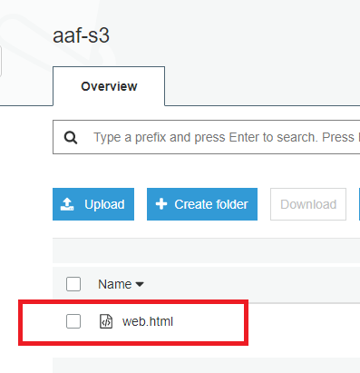
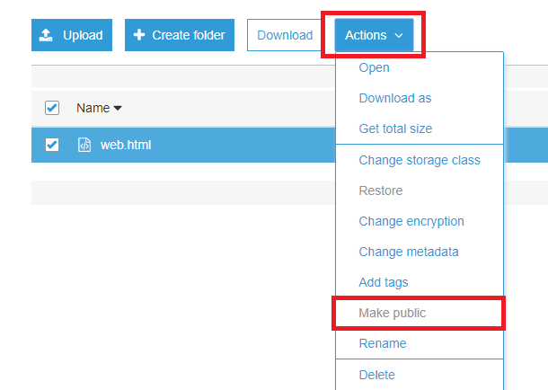
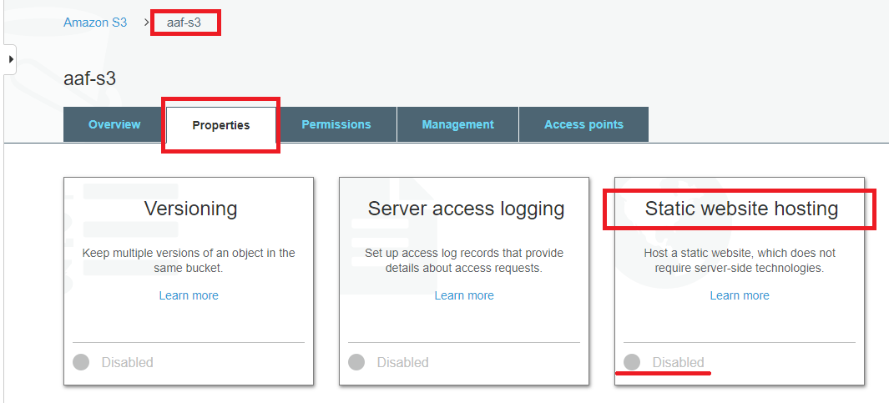
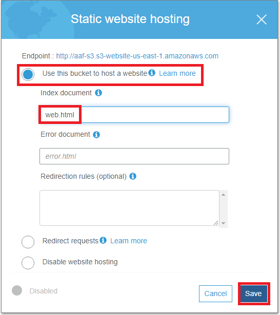
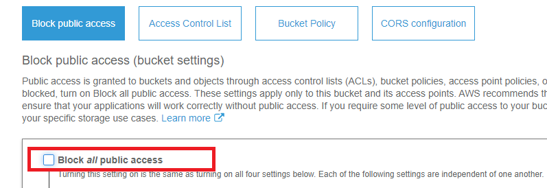
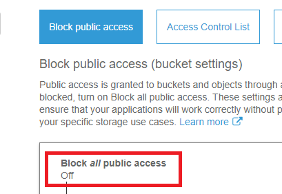
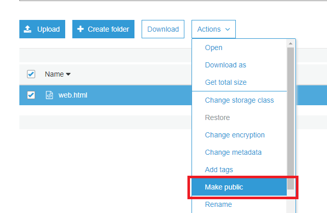
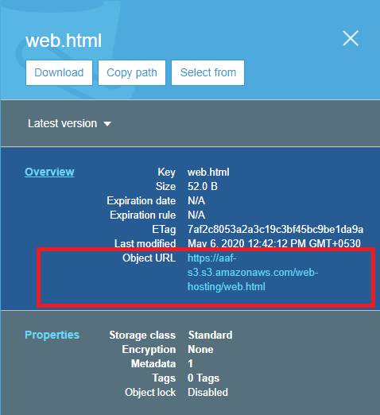
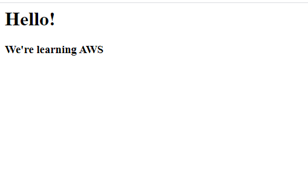

## Hosting a static website on S3:
- Amazon S3 can be used to host a static website.
- It doesn't support server-side scripting but offers other resources to do so.
- To host a static website, the webiste content is to be uploaded in the bucket and it can configured for website hosting.
- By default, the bucket restricts all public access to it. We'll  need to make the bucket public to host a website.

### Configuring a Bucket for website hosting:
 _**Pre-requisites**_: A bucket created in Amazon S3 with default configurations and a sample website content.
#### Step 1:
In **Amazon S3 console**, click on your bucket. **Upload** your website content. You can also create a seperate bucket for this purpose instead of adding files into the parent bucket.
#
 
#### Step 2:
Select the file you've uploaded. Click on **Actions** menu, you can see the **Make Public** option isn't active yet. As per default settings, the bucket restricts all public access.
#
 
#### Step 3:
To enable your bucket for website hosting, select your parent bucket and click on **Properties**. Here, you would find a property _**Static Website Hosting**_ in  _Disabled_ state.
#
 
Click on the **Static Website Hosting property**. Select **Use this bucket to host a website** option. Enter your file name that you've uploaded. Here, _web.html_ and hit **Save**.
This property would now show a checked-mark saying **Bucket Hosting**.
 #
 
#### Step 4:
Now click on **Permissions** menu. You'd find _**Block all public access**_ _**ON**_. Click on **Edit** available on the top right. De-select _**Block all public access**_ and **Save**.
 #
 
 
It would ask for confirmation. Type _confirm_ and click **Confirm**.
This might show an alert as _An unexpected error occurred_. Just switch the **Permissions** tab and check again. You're good to go.
 #
 
#### Step 5.
If you repeat **Step 2** now, you'd find **Make Public** option has turned active. 
 #
 
 
Click on it. A _dialogue box_ would pop-up. Hit **Make Public**.

#### Step 6:
Click on the website-content file that you've uploaded. You must be able to see _a slide-out panel_ on the right. You'd find **Object URL** in this panel.
 #
 
#### Step 7:
Click on **Object URL**. It would direct you to your _static webpage._
 #
 
#
#
<table width = "300%"><tr><th><a href = "S3.md">Previous</a></th><th> <a href = "x.md">Next</a></th></tr></table>
